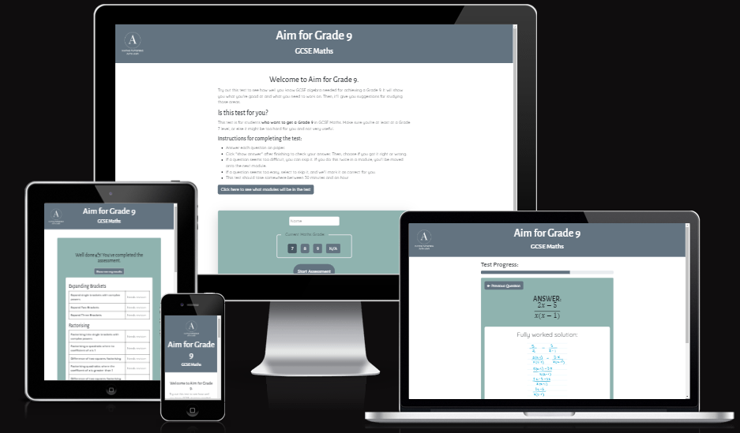
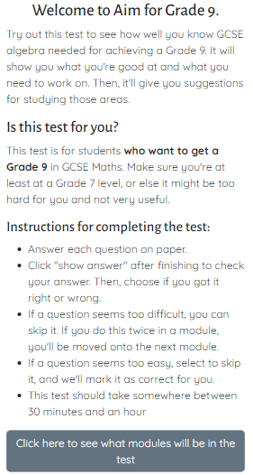
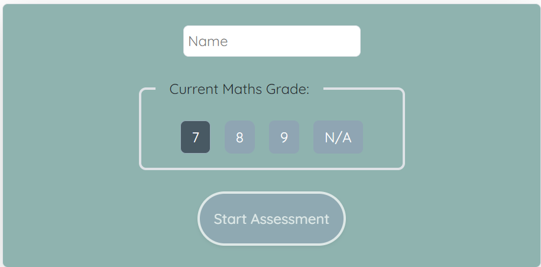
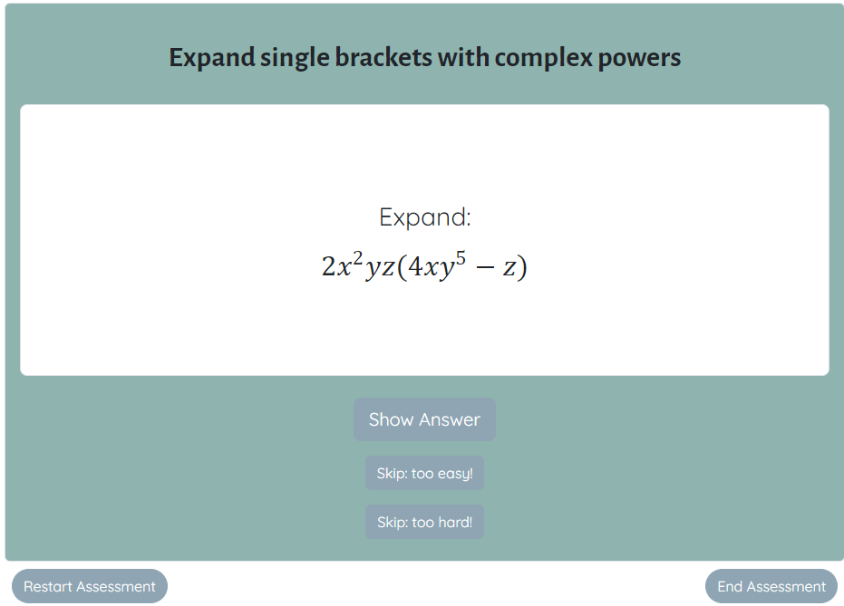
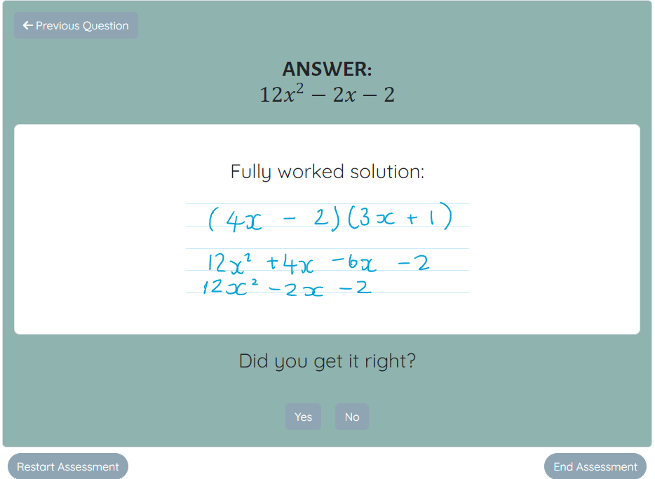
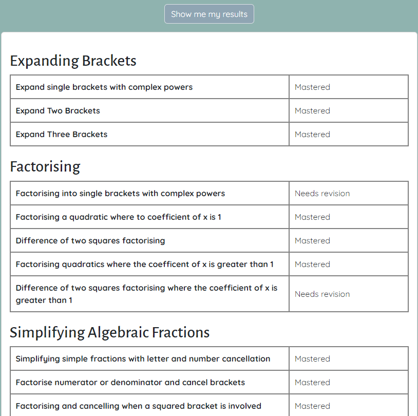
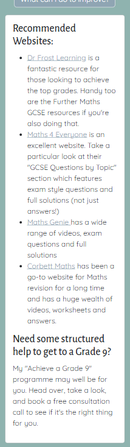
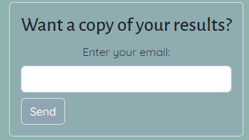
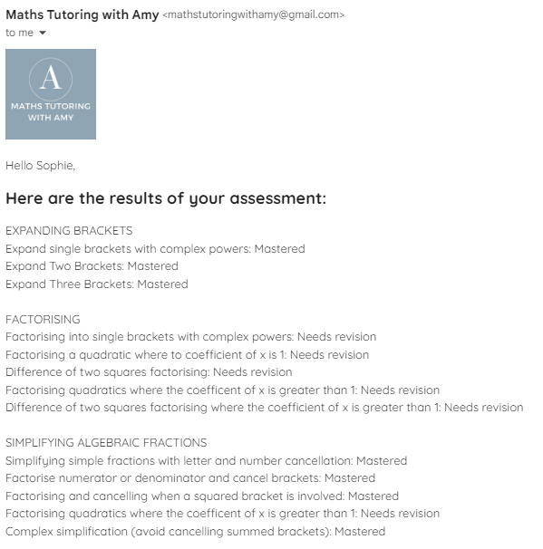

# Aim for 9 - Maths GCSE

The purpose of this website is to analyse the skill level of students aiming for a Grade 9 in their GCSE Maths and then provide them with specific places they can go to improve their level based on how they scored and how they answered the quiz and questionnaire. 

This is to complement my business "Maths Tutoring with Amy" and could potentially be linked to the website at a later date. 

[Deployed site here](https://amyb173.github.io/aimfor9-mathsGCSE/) 



## Table of contents

1. [UX Design](#ux-design-1)
   - 
   - [Strategy - User Stories](#strategy---user-stories) 
   - [Strategy - Business Goals](#strategy---business-goals) 
   - [Strategy - Importance vs Viability](#strategy---importance-vs-viability)
   - [Scope - How will the website meet the user stories and business goals](#scope---how-will-the-website-meet-the-user-stories-and-business-goals)
   - [Scope - Content](#scope---content)
   - [Structure](#structure)
   - [Skeleton - Wireframes](#skeleton---wireframes)
   - [Surface - Design Choices](#surface---design-choices)

2. [Logic Planning](#logic-planning-1)
   -

3. [Features](#features-1)
   -
   - [General Overview](#general-overview)
   - [Header](#header)
   - [Introductory Text](#introductory-text)
   - [Modules Button](#modules-button)
   - [Starting Section Input](#starting-section-input)
   - [Question Section](#question-section)
   - [Answer Section](#answer-section)
   - [Restart Assessment Button](#restart-assessment-button)
   - [Logo Button](#logo-button-in-header)
   - [End Assessment Button](#end-assessment-button)

3. [Tools and Technologies Used](#tools-and-technologies-used-1)
   -

4. [Testing](#testing-and-validation)
   -

5. [Deployment and Local Development](#deployment-and-local-development-1)
   -
6. [Credits](#credits-1)
   -
   * [Images](#images)


   * [Code](#code)
      - [Getting emailJS to work](#getting-email-js-to-work)
      - [Validating email input](#validating-email-input)


   * [Content](#content)

7. [Acknowledgments](#acknowledgments-1)
   -
## UX Design

### Strategy - User stories

Users will be students who are preparing and revising for their GCSE Maths, are already working at least at a Grade 7 and are aiming for a Grade 9. 

- (A) as a user, I want an assessment of what I do and do not know
- (B) as a user, I want to be directed to specific resources that I can > use to revise based on where I'm currently at
- (C) as a user, I want to be able to return to the website to see if > I've improved after doing the recommended work (later removed to make scope more manageable)
- (D) as a user, I want to be able to skip topics that I already know so I don't waste time completing those questions
- (E) as a user, I want to be able to return to my results at a later date

### Strategy - Business Goals
- as the business owner, I want my students to be more efficient in their revision so they are only revising those topics they currently can't access
- as the business owner, I want to increase visibility of my tutoring services by providing a valuable resource to parents

### Strategy - Importance vs Viability 

| Opportunity/Problem | Importance | Viability
| ----------- | ----------- | ----------- 
| 1. To provide an assessment for all topics required to achieve a grade 9 | 5 | 2 |
| 2. To provide a list all of the topics required to achieve a grade 9 | 5 | 5
| 3. To create personalised revision cards based on what they need to work on | 3 | 2 |
| 4. To provide links to videos on the topics they need to work on | 5 | 5
| 5. To provide practice questions and solutions for the topics they need to work on | 5 | 5
| 6. To have all the videos created by Maths Tutoring with Amy to encourage more visibility of the business | 3 | 3
| 7. To have all the worksheets created by Maths Tutoring with Amy to encourage more visibility of the business | 3 | 1
| Totals | 29 | 23

As these totals are quite different, this has highlighted that not all of these should be implemented. 

#### Adaptations
Opportunity 1's viability is low because the course is large, and to create an assessment covering every aspect of the course would be extremely time consuming and not feasible given the deadline. I will adapt this to be *algebra only*. The reasoning behind this is that algebra is the cornerstone of other topics and would potentially be the most useful to the student. I will remove Opportunity 3, 6, 7 because of time constraints however these can be implemented in the future. 


| Opportunity/Problem | Importance | Viability
| ----------- | ----------- | ----------- 
| 1. To provide an assessment for ALGEBRA topics required to achieve a grade 9 | 5 | 5 |
| 2. To provide a list all of the topics required to achieve a grade 9 (later removed to make the scope more manageable) | 5 | 5
| 4. To provide links to videos on the topics they need to work on | 5 | 5
| 5. To provide practice questions and solutions for the topics they need to work on | 5 | 5
| Totals | 20 | 20

By adapting one and removing three of the opportunities the totals equal and it has created a more manageable set of goals.

### Scope - how will the website meet the user stories and business goals? 

> #### Business Goal A - I want my students to be more efficient in their revision so they are only revising those topics they currently can't access
The whole premise of the website is to do this for students.

> #### Business Goal B - I want to increase visibility of my tutoring services by providing a valuable resource to parents
Business logo on the page and link to business website appearing at several stages without being overly interfering (business has a no hard-sell policy)


> #### User Story A - I want an assessment of what I do and do not know
- A test or assessment with questions that the student completes, with an option to see if they got it correct at each question. Don't bombard them with hard questions if they got early easy questions wrong (option to skip questions whether by user choice or by assessment). These will be only algebra-based initially. 

> #### User Story B - I want to be directed to specific resources that I can use to revise based on where I'm currently at
- The end of the assessment will produce a Red Amber Green list of all the topics required to get a grade 9 (Algebra) based on the answers provided. 
- The end of the assessment will provide a coherent set of instructions of how to improve. These will be in the form of videos, followed by questions and answers. 

> #### User Story C - removed

> #### User Story D - I want to be able to skip topics that I already know so I don't waste time completing those questions. 
- have an option to skip the question and indicate if it's because it's too easy or too hard (too hard => need to revise, too easy => don't need to revise)

> #### User Story E - I want to be able to return to my results at a later date

- the user will be given an option to have the results emailed to the recipient

### Scope - content

This is going to be a very content heavy project as the assessment will involve many questions and full, generally written, solutions in addition to instructional and tutorial videos.

**Ideal situation:** all questions, solutions, videos and revision materials will be produced by the business 

**Minimum viable product:** given the time constraints, and the fact that the business is in it's infant stage, most of the content will not be produced by the business but will instead be taken from websites that offer questions and solutions that can be freely used. These will be referenced to the user at every stage to increase traffic to these websites (these websites are mostly not for profit and do lots of good work so promoting and supporting them is important). 

### Structure

There will only be one page on this site in the first instance. 

On entering the website, you are presented with some instructions explaining the purpose of the page, then the following questions:

- What is your name? 
- What is your email address (optional - only to be used to send your results)? 
- First time or returning for a checkup?
- What grade are you currently working at? 

Then the user will be presented with a "start assessment" button. 

When the assessment starts each question will have the following: 
- title with topic name
- question 
- previous button (will take you to the previous question)
- Skip: question is too easy 
- Skip: question is too hard 
- Show answer

When "show answer" is clicked, the user is presented with: 

- Did you get it right? Yes or no.

For consistency, predictability and learnability each question will have the same layout and the buttons will stay in the same place. 

User will get feedback on each button clicked because a visible outcome occures (move to previous questions, answer is revealed, next question is revealed). 

At the end of the assessment, the user will be presented with two outcomes (their name and grade info will added for personalisation):
- an analysis of how they did (table with red/amber/green)
- then revision suggestions based on this 

Email me the results button will appear at the bottom if they would like results sent to them. 

### Skeleton - wireframes

#### Starting Section

#### Questions

#### Answer Reveal

#### Results


### Surface - Design Choices 

#### Colour Scheme
The colour scheme is in line with that of my business.


#### Typography 

Alegreya Sans for the headings:


Quicksand for the content: 


#### Imagery

There will be minimal imagery in this project. The logo from "Maths Tutoring with Amy" will be used and portrayed on each page: 


## Logic Planning
This is a high-level plan of how I envisage the logic working. 

The content for Grade 9 algebra will be split into "modules" that have "subtopics" of increasing difficulty.

Logic will be as follows: 

Student will start with Module 1, subtopic 1. 
- if the student gets the **answer correct** or they select **"Skip: too easy!** they move onto Module 1, subtopic 2. This subtopic is marked as **"mastered"** and they move onto the **next subtopic**. 
- if the student gets the **answer incorrect** or they select **"Skip: too hard!"** and this is the **first incorrect/hard skip** answer in this module, they still move onto the next question. This subtopic is marked **needs revision** and they move onto the **next subtopic**
- if the student gets the **answer incorrect** or they select **"Skip: too hard!"** and this is the **second incorrect/hard skip** answer in this module, they **skip the remaining subtopics**. This subtopic and all further subtopics in the module are marked **needs revision** and they move onto the **next module**

The logic will continue like this until all subtopics are noted as mastered or need revision.

### Modular and easily updated   
The aim is to ensure that people can easily add extra questions into modules and extra modules into the whole assessment. At the moment, this is designed to be a minimal test on specific algebra topics but could be expanded in the future for extra topics and grade levels. 

I will try to avoid any "hard coding" so that the programme doesn't rely on a specific number of modules or questions in each module.

## Features

### General Overview 

This website has been built as an assessment for Grade 9 students. It is designed as a single-page website that changes based on user interaction. The forward and back buttons cannot be used. 

Every section is responsive for screen sizes down to 320px width.

### Header

The includes the name of the webpage and then the overarching business logo from "Maths Tutoring with Amy". The logo can be clicked to redirect you back to the starting section.

On a small screen:


On a large screen: 


### Introductory Text
This section includes text to explain how the assessment works to guide the users. 

On a small screen: 



On a larger screen: 


### Modules Button
This is a collapsible button that will show all the modules currently in the test and the number of questions in each: 

On a small screen: 


On a larger screen: 


### Starting Section Input

This section allows the user to put in their name (not mandatory), their grade (not used but is there to indicate this test is only for Grade 7+), and then a start assessment button.

On a small screen:


On a larger screen: 


The chosen grade is darker than they others and the start assessment button gets a border when hovered over : 



### Question section

On a small screen: 


On a large screen: 



After the first question, a previous question button appears:


### Answer section

When the use clicks "show answer" button on the question section the answer appears with the workings shown below.

On a small screen: 


On a large screen:



### Restart Assessment Button
When the restart assessment button is clicked a modal appears warning them that their results will be erased - option to continue or restart given.


### Logo Button in Header 

When the logo is click in the header a warning is given that this will restart the assessment: 


### End Assessment Button 

When the end assessment button is clicked warning is given about all future answers being marked as incorrect: 


### Results Section 

The results section is personalised with the name of the person (if they inputted it).

When the assessment is ended js confetti appears over the screen with mathematical emojis: 


Once that has cleared it look like this on a small screen.


On a larger screen: 


### Show my my results button

The results of the test are presented in a table that is shown when the show me my results button is clicked. 

On a small screen: 


On a larger screen: 



### What can I do to improve button

This button shows a list of websites that can be used to revise these topics as well as directing them to use my website and direct business in that direction: 

On a small screen: 



On a larger screen: 


### Email

At the bottom of the results section is the option to have these results emailed to you. 

On a small screen: 



When the email is entered a spinner appears to show the waiting time before confirming the email has been sent successfully: 

https://github.com/AmyB173/aimfor9-mathsGCSE/assets/148871917/2f6d6106-7585-4b40-9043-0e307c4e1b5b

When an invalid email is entered a warning modal appears to notify the user: 

https://github.com/AmyB173/aimfor9-mathsGCSE/assets/148871917/3bb67776-2109-4eb0-8fda-ca9c60c8ff23

When the email is unsuccessful the user is also warned and then the spinner disappears after button is clicked:

https://github.com/AmyB173/aimfor9-mathsGCSE/assets/148871917/82880c63-44bc-4bab-9930-534f3a043e80

### Example email

This is what the email that is delivered looks like:




### Changes from initial planning

Without realising it, I had created too much work for the project. To this end, the following changed were made:

- User Story C has been deliberately removed as it is not essential to the essence of the project and is a "nice-to have".
- As the project was only on the algebra topics, it has not been necessary to provide a full list of all the topics needed for Grade 9 and would create some confusion (why are all topics listed if we are only being tested on the algebra?)
- Intially, I had imagined giving *very* personalised ways to improve by linking specific videos and worksheets to each question they did not master. This would have been a tremendous amount of work. I have simplified this to direct them towards websites that all have videos and worksheets on all the topics in the test and it would only require them to navigate to the website and find the topic.

I also decided to have the option to enter the email at the end, as I didn't want it to be a pre-requisite for taking the test. I wanted it to be accessible. They can choose at the end whether they would like their results emailed.

### Future implementations

- To have an option to check back later and see if you've improved (with different questions). This would need to be implemented with a second set of modules with the same topics but different questions.

- To have more personalisation in the results, where specific videos and worksheets are given for each topic.

- To have the option to save your results as a pdf instead of emailed.

- To have the test only accessible to those sign up to a mailing list (for marketing purposed)

- To offer all the topics needed to achieve a Grade 9.

## Tools and Technologies Used
 - Custom HTML, CSS and JS were used throughout.
 - [Bootstrap v5.3](https://getbootstrap.com/) was used for layout and styling
 - [JQuery v3.7.1](https://jquery.com/) was used in conjunction with vanilla JS
 - Git for version control
 - Github for saving and storing files
 - VS Code for locally coding my project (to replace the use of online IDE such as Gitpod or Codeanywhere)
 - [Google Fonts](https://fonts.google.com/) for the font used in the website
 - Google developer tools to test the website for responsiveness and to fix bugs.
 - [Picture to people](https://www.picturetopeople.org/text_generator/others/transparent/transparent-text-generator.html "Picture to People website") was used to generate the title with a transparent background that appears in the header.
 - [Image Resizer](https://imageresizer.com "Image Resizer Website") was used to compress and resize images. 
- [Pixelied](https://pixelied.com/convert/png-converter/png-to-webp) to convert images to webp.
 - [Canva](https://canva.com "Canva Website") was used to generate the colour palette. 
  - [Font Awesome](https://fontawesome.com/) was used for all icons used on my page.
 - [Am I Responsive?](https://www.google.com/search?q=am+i+responsive&rlz=1C1ONGR_en-GBGB985GB985&oq=am+i+respon&gs_lcrp=EgZjaHJvbWUqBggAEEUYOzIGCAAQRRg7MgYIARBFGDkyBggCEEUYQDIGCAMQRRhBMgYIBBBFGDwyBggFEEUYPNIBCDE4NTRqMGo3qAIAsAIA&sourceid=chrome&ie=UTF-8) to show how the website looks on different size screens and devices.
 - [Math Type](https://mathtype.en.softonic.com/) to convert equations to Mathematical Markup Language so that MathJax can render them
 - [MathJax](https://www.mathjax.org/) to present equation
- [JS Confetti](https://www.npmjs.com/package/js-confetti) was used to display emojis as confetti at the end of the test
 - WAVE chrome extension for accessibility testing
 - WCAG Contrast checker chrome extension for colour contrast checking
- [W3C Validator](https://validator.w3.org/) for validating HTML and CSS


## Testing and Validation


## Deployment and local development

### Deployment

GitHub Pages was used to deploy the live website. The instructions to achieve this are below:

1. Log in to GitHub
1. Find the repository for this project (AmyB173/aimfor9-mathsGCSE)
3. Click on the Settings button at the top of the screen.
4. Click on the Pages button on the left navigation bar.
5. Go to the Build and Deployment section. 
6. Make sure the Source is "deploy from a branch"
7. Go to the Branch section, choose main and /root.
8. Click Save. Your live Github Pages site is now deployed at the URL shown.

### Local Development

#### How to Fork:
To fork the double-seven-guitars repository:

1. Log in to GitHub
2. Go to the repository for this project (AmyB173/aimfor9-mathsGCSE)
3. Click the Fork button on the top right

#### How to Clone

##### In VS Code: 
1. Open VS Code
2. Select "Clone Git repository"
3. Type in https://github.com/AmyB173/aimfor9-mathsGCSE.git 
4. Choose a local destination for the folder
5. Click open

##### In Gitpod 
1. Sign in to Gitpod
2. Select new workspace 
3. Type in https://github.com/AmyB173/aimfor9-mathsGCSE.git 

## Credits

### Images


### Code 


#### General

- To install Bootstrap via npm so that I could do some customisation, I watched this tutorial video: https://www.youtube.com/watch?v=WPAiTlQr7no 
- I used the following websites to learn about MathML, MathJax CDN and MathType for creating accessible and well-presented equations:  
   -  https://www.w3.org/Math/whatIsMathML.html 
   - https://stackoverflow.com/questions/12431339/how-to-write-equations-in-html
   - https://accessibility.oit.ncsu.edu/putting-math-on-the-web-using-mathml-and-html5/
   - [MathJax Documentation](https://docs.mathjax.org/en/latest/basic/mathematics.html)
- To get the footer to stick to the bottom of the page with bootstrap: https://radu.link/make-footer-stay-bottom-page-bootstrap/


#### Specific Code 

#### Getting Email JS to Work

I was struggling to get my head around the documentation on emailJS and so I used [this](https://github.com/yamesjamess/feb-24-hackathon-love-riot) project as a guide for me - I then adapted it for my own needs. You can see I took the general structure but adapted it with my own function "poplateResultsTable", I fixed the issue of the spinner staying present after failure message and added in a email validation code so it couldn't be sent unless the email was valid.

##### Their code
```
// Links to EmailJS Account -
// Initialize EmailJS user ID
emailjs.init("eW8pEkcltsdImigyc");

const sendBtn = document.getElementById("sendEmail");
const emailForm = document.getElementById("email");

const sendEmail = () => {
  const email = document.getElementById("email").value;
  const userName = document.getElementById("user-name").value;
  const crushName = document.getElementById("crush-name").value;
  const compatibilityPercentage = document.getElementById(
    "compatibility-percentage"
  ).innerText;

  // check the game first if the user have calculated or not
  if (compatibilityPercentage === "80%" && compatibilityPercentage === "0%") {
    alert("you have to calculate first");
  }
  // only send email if the user has input username,
  // crush name, email, and calculate their score
  else if (
    userName &&
    crushName &&
    email &&
    compatibilityPercentage !== "80%" &&
    compatibilityPercentage !== "0%"
  ) {
    emailjs
      .send("service_6heqq18", "template_nq4vvcz", {
        to_email: email,
        subject_from_name: userName,
        crush_name: crushName,
        user_name: userName,
        compatibilityPercentage: compatibilityPercentage,
      })
      .then(
        function (response) {
          // Show Bootstrap alert
          const alertSuccess = document.getElementById("alertSuccess");
          alertSuccess.style.display = "block";
          // Hide after 5 seconds
          setTimeout(() => {
            alertSuccess.style.display = "none";
          }, 2500);
        },
        function (error) {
          alert("Failed to send the email.");
        }
      );
  } else {
    alert(
      "Please enter your name, crush's name, email and calculate the score first!"
    );
  }
};

const handleEnterKey = (e) => {
  if (e.key === "Enter") {
    e.preventDefault();
    document.getElementById("sendEmail").click();
  }
};

if (sendBtn && emailForm) {
  sendBtn.addEventListener("click", sendEmail);
  emailForm.addEventListener("keydown", handleEnterKey);
}
```
##### My code
```
import {
    modules
} from './questions.js';


// CREDIT: I used the follow repository as a guide on how to use emailJS correctly: https://github.com/yamesjamess/feb-24-hackathon-love-riot
// CREDIT: full details in readme

// Links to EmailJS Account -
// Initialize EmailJS user ID
emailjs.init("k1hA0o1HzShiQtmFq");

// My OWN CODE
const populateResultsForEmail = () => {
    let resultsString = "";
    for (const module of modules) {
        resultsString += `${module.displayName}`.toUpperCase() + "\n";
        for (const question of module.content) {
            let mastered;
            question.mastered ? mastered = "Mastered" : mastered = "Needs revision";
            if (question.questionCode == module.content.length) {
                resultsString += question.name + ": " + mastered + "\n\n";
            } else {
                resultsString += question.name + ": " + mastered + "\n";
            }
        }
    }
    return resultsString;
}

//Code adapted - see credit above 
const sendEmail = () => {
    const email = document.getElementById("email").value;
    const resultsInfo = populateResultsForEmail();
    const username = $("#studentName")[0].innerHTML;
    const spinner = $(".spinner-grow");

    spinner.removeClass("d-none");
    emailjs
        .send("service_pnqn1sn", "template_b2pynfe", {
            to_email: email,
            name: username,
            results: resultsInfo
        })
        .then(
            
            function (response) {
                spinner.addClass("d-none");
                // Show Bootstrap alert
                const alertSuccess = document.getElementById("alertSuccess");
                alertSuccess.style.display = "block";
                document.getElementById("email").value = "";
                // Hide 
                setTimeout(() => {
                    alertSuccess.style.display = "none";

                }, 5000);
            },
            function (error) {
                alert("Failed to send the email - please try again");
                spinner.addClass("d-none");
            }
        );
}

// CREDIT: code taken from here: https://www.w3resource.com/javascript/form/email-validation.php
function validateEmail() {
    const email = document.getElementById("email").value;
    if (/^\w+([\.-]?\w+)*@\w+([\.-]?\w+)*(\.\w{2,3})+$/.test(email)){
    return (true)
    }
    alert("You have entered an invalid email address!")
    return (false)
}

$("#sendEmail").on("click", () => {
    if (validateEmail()) {
        sendEmail();
    }
});

$("#email").on("keydown", (event) => {
    if (event.key === "Enter") {
      event.preventDefault();
      sendEmail();
    }
  })
```


#### Validating email input

I used the following code in my email.js file exactly from [here](https://www.w3resource.com/javascript/form/email-validation.php): 

```
function validateEmail() {
    const email = document.getElementById("email").value;
    if (/^\w+([\.-]?\w+)*@\w+([\.-]?\w+)*(\.\w{2,3})+$/.test(email)){
    return (true)
    }
    alert("You have entered an invalid email address!")
    return (false)
}
```


### Content

All content was created by me.

## Acknowledgments

