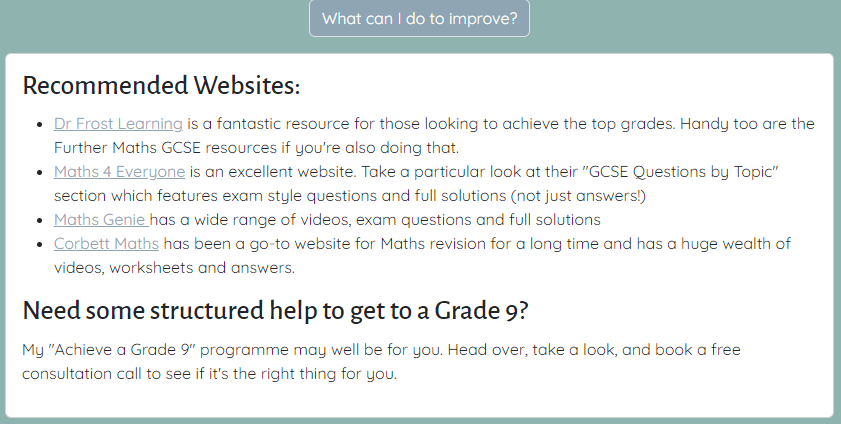
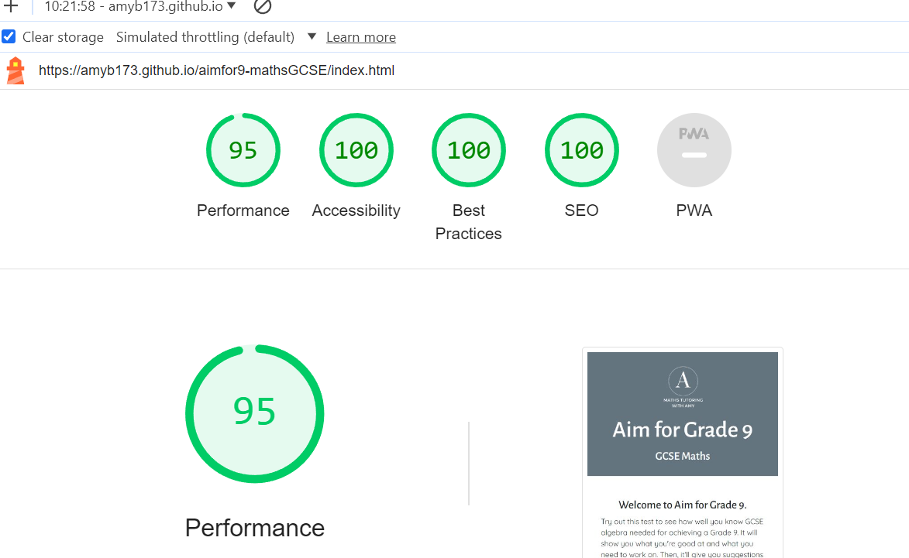

# Bugs, testing and validation

1. [Bugs and Fixes](#bugs-and-fixes)
2. [Manual Testing](#manual-testing)
    - [Content Testing](#content-testing)
    - [Feature Testing](#feature-testing)
    - [User Story Testing](#user-story-testing)
    - [Responsiveness Testing](#responsiveness-testing)
    - [Browser and Device Testing](#browser-and-device-testing)
    - [Accessibility Testing](#accessibility-testing)
3. [Automated Testing](#automated-testing-validation-and-lighthouse-testing)
    - [HTML Validation](#html-validation)
    - [CSS Validation](#css-validation)
    - [JS Validation](#js-validation)
    - [Lighthouse Testing](#lighthouse-testing)

## Bugs and fixes

### Spinner not disappearing after failed email send

When entering an email at the end, the user is notified if the email failed to send. I encountered the issue of the spinner continuing to show long after this message disappeared. I fixed this by finding the place where the spinner needed to be removed: 


### Selecting elements using the ID in jQuery

I often has the issue of trying to access the innerHTML of an element with a particular id, but couldn't get it to work. I assumed because id are by nature unique one particular element, that I wouldn't need to give an index, however, I realised that using jQuery to inspect the DOM an array is always returned so I needed to specify the index of 0 even if I was using an id to target it: 


### Counting lengths
I was trying to create a function to see if we were at the end of the test. I wanted to count the number of modules and check if I was on the last module. I wanted to count the length of the array containing the modules but kept getting an error that length() wasn't a property of what I was trying to access. I used the following code:

```
modules.find(module => module.name === "module" + currentModuleCode).length
```
However, given the fact I had objects within arrays within objects etc I didn't realise that what I needed to count was in fact just the modules array. 

```
modules.length
```
The above counted the amount of modules so I could check if I was at the end. A silly but time consuming error. However, I used the debugging tool in chrome and developed my knowledge of this a little further. 

### Attempting to install bootstrap and jQuery via npm  
I wanted to try and install bootstrap and jQuery locally via npm so I could customise Bootstrap via altering the sass variables. Given this worked for bootstrap I tried doing this jQuery which worked locally. 

As this is my first time using node modules and installing via npm, I didn't realise that git ignores node_modules and that github pages is designed for static pages and does not generally host the external libraries and frameworks. 

To this end I reverted to using the CDN links for most of this. 

This was a good learning opportunity even if it was costly in terms of time. 


### Equations not displaying properly

Fairly early on, I was testing whether the questions and answers were displaying correctly and the first answer I attempted to put it was appearing without anything following the first number: 


I spent a long time using dev tools and tried to change the element from a heading to a paragraph, I tried altering the display properties in case it was being hidden. Eventually, I realised it was how I was using Math Type to generate the MathML code (a rogue enter sign or space was the issue I think) as when I retyped it in Math type and generate new code, it worked.

### Accessibility 

I was initially going to use images to present my equations but I realised this would not be very accessible for people using screen readers and so after some research I decided to use MathML to code equations. See [this](https://www.chhs.colostate.edu/accessibility/best-practices-how-tos/mathml/#:~:text=MathML%20is%20a%20way%20of,text%2Dto%2Dspeech%20software.) page for accessibility of MathML.

### Bootstrap class errors

These were found during validation - see validation section for full details of fix.

## Testing Note

I decided to add a progress bar into my project after all the testing was complete. I then re-did all tests and added in progress bar tests. If nothing changed, I did not update the test results here.

## Manual Testing

During the development process, I continuously manually tested small elements of the site to check functionality and remove bugs.

I plan to do mostly manual testing for the functionality except for lighthouse and validation and WAVE accessibility testing which are automated processes. Automating things like performance testing and accessibility testing is preferred as manual testing would be laborious and impractical.


### Content Testing

<details>

<summary>Initial Tests (partial fail)</summary>

| Content test                                           | Pass/Fail                  |
| ------------------------------------------------------ | -------------------------- |
| All questions match all answers                        | Pass                       |
| All answers match solution                             | Fail (final question)      |
| All question titles correspond to the question content | Fail (Module 3, Question 4) |
</details>
<details>
<summary>After making changes (all pass)</summary>

| Content test                                           | Pass/Fail                  |
| ------------------------------------------------------ | -------------------------- |
| All questions match all answers                        | Pass                       |
| All answers match solution                             | Pass     |
| All question titles correspond to the question content | Pass |

</details>

### Feature Testing

<details>
<summary>Feature tests (all pass)</summary>

| Feature                                                                                                                                | Expected outcome                                                                                                                                                                                                                             | Pass/Fail |
| -------------------------------------------------------------------------------------------------------------------------------------- | -------------------------------------------------------------------------------------------------------------------------------------------------------------------------------------------------------------------------------------------- | --------- |
| **START PAGE**                                                                                                                         |                                                                                                                                                                                                                                              |           |
| Website link in footer                                                                                                                 | When clicked takes you to the website in a new tab                                                                                                                                                                                           | Pass      |
| Button to reveal modules in test                                                                                                       | When the button is clicked, a list of all the modules a number of questions appear.                                                                                                                                                          | Pass      |
| Enter name                                                                                                                             | Name can be entered, same name appears on the results page, same name appears in the email                                                                                                                                                   | Pass      |
| Don't enter name                                                                                                                       | Enter name is optional so assessment should start without it when start assessment button is clicked                                                                                                                                         | Pass      |
| Enter grade                                                                                                                            | All grades can be entered, they do not appear elsewhere in the test                                                                                                                                                                          | Pass      |
| Start assessment button                                                                                                                | When clicked the first question appears                                                                                                                                                                                                     | Pass      |
| **QUESTION SECTION FUNCTIONALITY**                                                                                                                          |                                                                                                                                                                                                                                              |           |
| Previous button takes you to the previous question (except on question 1)                                                              | TEST ALL QUESTIONS: When the previous button is clicked, the previous question appears (and no previous button option is available for the first question)                                                                                   | Pass      |
| Show answer button                                                                                                                     | TEST ALL QUESTIONS: When the show answer button is clicked, the question disappears and the answer and full solution appears                                                                                                                 | Pass      |
| No button, moves onto next question                                                                                                    | TEST ALL QUESTIONS: When the no button is clicked, the answer disappears and the next question title and question appear.                                                                                                                    | Pass      |
| Yes button, moves onto next question                                                                                                   | TEST ALL QUESTIONS: When the yes button is clicked, the answer disappears and the next question title and question appear.                                                                                                                   | Pass      |
| Too easy button, moves onto the next question                                                                                          | TEST ALL QUESTIONS: When the too easy button is clicked, the next question title and question appear.                                                                                                                                        | Pass      |
| Too hard button, moves onto the next question                                                                                          | TEST ALL QUESTIONS: When the too hard button is clicked, the next question title and question appear.                                                                                                                                        | Pass      |
| Results table appears on last page with correct summary                                                                                | Test a combination of "yes" "no" "too easy" "too hard" to check results are being presented correctly                                                                                                                                        | Pass      |
| If two questions in a module are "too hard" or "no", then move onto the next module                                                    | TEST ALL MODULES: when two incorrect answers are given, the next module's first question appears                                                                                                                                             | Pass      |
| If two questions in a module are "too hard" or "no", then  all remaining questions are marked as "Needs revision" in the results table | TEST ALL MODULES: when two incorrect answers are given, all remaining questions appear as "needs revision"                                                                                                                                   | Pass      |
| When final question in the test is completed, confetti appears and results page appear                                                 | Answer all question in final module correctly, last question triggers confetti and appearance of results page                                                                                                                                | Pass      |
| If two questions in the last module are "too hard" or "no" then confetti and results page appear                                       | Answer two questions in the final module incorrectly, last question triggers confetti and appearance of results page                                                                                                                         | Pass      |
| Buttons on results page reveal results table and suggested revision                                                                    | When clicked each button reveals the correct section, when clicked again the section disappears                                                                                                                                              | Pass      |
| **PROGRESS BAR**                                                                                                                  |                                                                                                                                                                                                                                              |           |
| Progress Bar                                                                                       | When moving through the questions either by clicking yes, no, too easy or too hard, the progress bar increases | Pass      |
| Progress Bar                                                                                       | When going back to a previous question, the progress bar decreases | Fail     |
| **END ASSESSMENT BUTTON**                                                                                                                  |                                                                                                                                                                                                                                              |           |
| End assessment button, confirms,  ends the test                                                                                        | When end assessment button is clicked, a warning appears informing the user that all remaining questions will be marked incorrect, user clicks "understood" and results page appears with all remaining questions marked as "needs revision" | Pass      |
| End assessment button, clicks cancel, continues with test                                                                              | When end assessment button is clicked, a warning appears informing the user that all remaining questions will be marked incorrect, user clicks "cancel" and test continues as normal                                                         | Pass      |
| End assessment button, clicks the cross in top right, continues with test                                                              | When end assessment button is clicked, a warning appears informing the user that all remaining questions will be marked incorrect, user clicks cross in top-right corner and test continues as normal                                        | Pass      |
| **RESTART ASSESSMENT BUTTON**                                                                                                              |                                                                                                                                                                                                                                              |           |
| Restart assessment button, clicks understood, start page appears                                                                       | When the end assessment button is clicked, user receives warning that all information will be erased, user clicks understood, start page appears                                                                                             | Pass      |
| Restart assessment button, click cancel, continues with test                                                                           | When the end assessment button is clicked, user receives warning that all information will be erased, user clicks cancel, test continues as normal                                                                                            | Pass      |
| Restart assessment button, click cross in top right, continues with test                                                               | When the end assessment button is clicked, user receives warning that all information will be erased, user clicks cross in top-right, test continues as normal                                                                               | Pass      |
| **LOGO BUTTON**                                                                                                                            |                                                                                                                                                                                                                                              |           |
| Logo button, clicks understood, start page appears                                                                                     | When the logo button is clicked, user receives warning that all information will be erased, user clicks understood, start page appears                                                                                                       | Pass      |
| Logo button, click cancel, continues with test                                                                                         | When the logo button is clicked, user receives warning that all information will be erased, user clicks cancel, test continues as normal                                                                                                      | Pass      |
| Logo button, click cross in top right, continues with test                                                                             | When the logo button is clicked, user receives warning that all information will be erased, user clicks cross in top-right, test continues as normal                                                                                         | Pass      |
| **EMAIL**                                                                                                                                  |                                                                                                                                                                                                                                              |           |
| Email: Enter correct email and receive results                                                                                         | Enter correct email address, see spinner, see success message, receive email with the correct results                                                                                                                                        | Pass      |
| Email: Enter invalid email and receive warning of incorrect email address                                                              | Enter invalid email address, see spinner, receive warning of invalid email                                                                                                                                                                   | Pass      |
| Email: Enter correct email and receive warning the email did not send                                                                  | (Force this situation by temporarily changing the emailjs template) Enter correct email, see spinner, receive warning of email failing to send                                                                                               | Pass      |

</details>

#### Fix and repeated tests for progress bar

To ensure the progress bar goes back when the user clicks to a previous question, I called the updateProgress function every time the previous button is clicked. I re-completed the tests: 

| **PROGRESS BAR**                                                                                                                  |                                                                                                                                                                                                                                              |           |
| Progress Bar                                                                                       | When moving through the questions either by clicking yes, no, too easy or too hard, the progress bar increases | Pass      |
| Progress Bar                                                                                       | When going back to a previous question, the progress bar decreases | Pass    |

### User Story Testing

The below user stories where created in the readme at the onset of the project. I will test the website against these.

<details>
<summary><strong>(A) as a user, I want an assessment of what I do and do not know</strong></summary>
This was later refine to just ALGEBRA in the scope section of my design. This has been met as the test assesses the student based on their inputs and gives a table of results at the end that informs the student on what they do and do not currently know how to do. 

Question to assess what they know 

An answer and solution so they can determine whether they got it right:

Table of results detailing a summary of what they know:
 


</details>
<br/>
<details>
<summary><strong>(B) as a user, I want to be directed to specific resources that I can use to revise based on where I'm currently at</strong></summary>
At the end of the test, the user is directed to specific websites to improve on the topics they didn't do well on. 


</details>
<br/>

<details>
<summary><strong>(C) as a user, I want to be able to return to the website to see if I've improved after doing the recommended work (later removed to make scope more manageable)</strong></summary>
Initially I envisaged making two sets of almost identical questions with different numbers to avoid false results by just "remembering" the answer but this was removed due to time constraints. This is still partially met as the user can still return to the website and do the test again. If they opt for the email, they can compare their current results with their previous results:


</details>
<br/>

<details>
<summary><strong>(D) as a user, I want to be able to skip topics that I already know so I don't waste time completing those questions</strong></summary>
This has been met through the "too easy" and "too hard" buttons. The too easy button stops them having to do the whole question if they already know how to do it. Additionally, too hard avoids them wasting time on a question they won't be able to do anyway. 

See too easy and too hard buttons: 


</details>
<br/>

<details>
<summary><strong>(E) as a user, I want to be able to return to my results at a later date</strong></summary>
This has been met by the option to have the results emailed:


</details>
<br/>

## Responsiveness testing

### Method for testing and breakpoints used

I will use Google Chrome and Firefox developer tools in "responsive" mode to slowly move the screen to make it continuously larger within certain breakpoints.

I have used the Bootstrap breakpoints for this testing. 

I will also test the exact resolutions of a common mobile, tablet and monitor. I used 360x800, 768x1024 and 1920x1080. I decided these based on popularity of use using [this](https://www.linkedin.com/pulse/most-popular-screen-resolutions-mobile-tablet-desktop-elziady/) article. 

### Testing 

All pages were tested, and developer tools were used on both Chrome and Firefox. 

|   Screen width | Expected Outcome  | Pass/Fail |
| ---------------------------- | ------------- | --------- |
| 320px - 575px  | No errors where items are overlapping, touching the edge of the screen when they shouldn't, or text being pushed under or out of the container. Modals appear well and are still functional. All buttons can be used on all screen sizes. All sizes seem proportionate to screen size | Fail |
| 576px - 767px  | Same as first row |  Pass  |
| 768px - 991px | Same as first row   | Pass |
| 992px - 1199px | Same as first row   | Pass |
| 1200px - 1400px | Same as first row   | Pass |


|  Device          | Expected Outcome  | Pass/Fail |
| ---------------------------- | ------------- | --------- |
|Mobile | No errors where items are overlapping, touching the edge of the screen when they shouldn't, or text being pushed under or out of the container. Modals appear well and are still functional. All buttons can be used on all screen sizes. All sizes seem proportionate to screen size | Pass |
| Tablet  | Same as first row |  Pass  |
| Desktop | Same as first row   | Pass |

#### Failed Tests and Fixes

On the smallest screen, the padding was causing the content to look too squashed or too close to the edge: 


When I increase and decreased the padding respectively, it presented much more nicely on the smallest screens:


#### Repeated Failed Tests

|   Screen width | Expected Outcome  | Pass/Fail |
| ---------------------------- | ------------- | --------- |
| 320px - 575px  | No errors where items are overlapping, touching the edge of the screen when they shouldn't, or text being pushed under or out of the container. Modals appear well and are still functional. All buttons can be used on all screen sizes. All sizes seem proportionate to screen size | Pass |

### Browser and device testing  
- During the functionality testing, all checks were made on Chrome, Firefox and Edge. 

- During the responsiveness testing all of the testing was done on Chrome and  Firefox. 

- I also used this website on a variety of Android phones and checked it was working as expected. 

- I did not have access to any Apple products so I couldn't do any full testing with Safari without spending money on simulators. 


### Accessibility Testing

I have included this here even though part of it is automated (WAVE chrome tool).

- I made sure the all the questions and answers were created using MathML and MathJax which ensures it can be read by screen readers: [See this article](https://www.chhs.colostate.edu/accessibility/best-practices-how-tos/mathml/#:~:text=MathML%20is%20a%20way%20of,text%2Dto%2Dspeech%20software.)
- I am aware that the "full solution" section which was handwritten by me, will not be screen readable, but the site still remains completely useable as the solution is a nice-to-have and not essential for completing the test. It is common practice on a lot of educational websites to use handwritten mathematical solutions.

#### WAVE Chrome Extension Testing

Several issues were raised: 

- **Colour Contrast**: this was raised as the white text against the grey background was not providing enough contrast. I have changed the grey to a darker version #637380 to improve accessibility and so it is not longer flagged by WAVE. 

- **Missing Form Label**: I added a visually hidden label for the name input to resole this

- **Possible headings not being labelled**: The wording of the questions was identified as a possible heading. I feel, on balance, this would be misleading to label as a heading. 

- **Repetition of the same alt text**: I'm happy to accept this as it is the logo appearing twice on the page (header and footer) and it makes sense to have the same alt text.


## Automated Testing (Validation and Lighthouse Testing)

### HTML Validation

#### Index.html

The initial validation threw a few errors that were small things that were easily fixed, such as extra hyphens, duplicated ids, incorrect aria controls. 

<details>
<summary>Initial HTML validation</summary>


</details>

<details>
<summary>Final HTML Validation with no errors</summary>
 I decided to leave the "type" on the emailJS script tag as this was taken directly from their website and this was just a warning. 


</details>

#### 404.html


### CSS validation 

The first validation produced 16 errors all of which came from empty properties in the bootstrap classes. There must have been an issue in compiling the scss files which caused these empty properties:


There were empty classes in the compiled main.css file which I deleted (see bs-dropdown-box-shadow): 


I also deleted the correlating classes in the original scss file in the node modules folder on my local machine. In the following I would delete drop-box-shadow:


After doing this the css validated without error: 


I am aware this has not solved the root cause of the issue but the properties were minor ones that were not affecting my code and so I was happy at this stage to just move them. 

### JS Validation 

I use JSHint to check my javaScript for errors. It mostly picked up on missing semi-colons. I also reformatted how I used ternary operators too. All now have no major issues and the undefined variables are only because the pages are being tested in isolation.

<details>
<summary>index.js</summary>


</details>

<details>
<summary>email.js</summary>


</details>

<details>
<summary>questions.js</summary>


</details>

### Lighthouse Testing

#### Main Page




#### 404 Page


